<div align="center">


###  My Home Operations Repository 

_... managed with Flux, Renovate, and GitHub Actions_ 

</div>

<div align="center">

[](https://discord.gg/home-operations)&nbsp;&nbsp;
[](https://talos.dev)&nbsp;&nbsp;
[](https://kubernetes.io)&nbsp;&nbsp;
[](https://fluxcd.io)&nbsp;&nbsp;
[](https://github.com/tholinka/homelab/actions/workflows/renovate.yaml)

</div>

<div align="center">

[](https://status.tholinka.dev)&nbsp;&nbsp;
[](https://status.tholinka.dev)&nbsp;&nbsp;
[](https://status.tholinka.dev)

</div>

<div align="center">

[](https://github.com/kashalls/kromgo)&nbsp;&nbsp;
[](https://github.com/kashalls/kromgo)&nbsp;&nbsp;
[](https://github.com/kashalls/kromgo)&nbsp;&nbsp;
[](https://github.com/kashalls/kromgo)&nbsp;&nbsp;
[](https://github.com/kashalls/kromgo)&nbsp;&nbsp;
[](https://github.com/kashalls/kromgo)&nbsp;&nbsp;
[](https://github.com/kashalls/kromgo)&nbsp;&nbsp;
[](https://github.com/kashalls/kromgo)

</div>

## 💡 Overview

This is a mono repository for my home infrastructure and Kubernetes cluster. I try to adhere to Environment as Code (EaC), Infrastructure as Code (IaC) and GitOps practices using tools like [Kubernetes](https://kubernetes.io/), [Flux](https://github.com/fluxcd/flux2), [Renovate](https://github.com/renovatebot/renovate), and [GitHub Actions](https://github.com/features/actions).

##  Kubernetes

My Kubernetes cluster is deployed with [Talos](https://www.talos.dev). This is a semi-hyper-converged cluster, workloads and block storage are sharing the same available resources on my nodes while I have a separate server with BTRFS for NFS/SMB shares, bulk file storage and backups.

### Core Components

- [actions-runner-controller](https://github.com/actions/actions-runner-controller): Self-hosted Github runners.
- [cert-manager](https://github.com/cert-manager/cert-manager): Creates SSL certificates for services in my cluster.
- [cilium](https://github.com/cilium/cilium): eBPF-based networking.
- [cloudflared](https://github.com/cloudflare/cloudflared): Enables Cloudflare secure access to routes.
- [external-dns](https://github.com/kubernetes-sigs/external-dns): Automatically syncs ingress DNS records to Cloudflare and Unifi.
- [external-secrets](https://github.com/external-secrets/external-secrets): Managed Kubernetes secrets using [Bitwarden Secrets Manager](https://github.com/external-secrets/bitwarden-sdk-server/).
- [rook](https://github.com/rook/rook): Distributed block storage for persistent storage.
- [spegel](https://github.com/spegel-org/spegel): Stateless cluster local OCI registry mirror. No more image pull backoff.
- [volsync](https://github.com/backube/volsync): Automatic backup and recovery of persistent volume claims to NFS and Cloudflare R2. Lose nothing when the cluster blows up!

### GitOps

[Flux](https://github.com/fluxcd/flux2) watches the clusters in my [kubernetes](./kubernetes/) folder (see Directories below) and makes the changes to my clusters based on the state of my Git repository.

The way Flux works for me here is it will recursively search the `kubernetes/apps` folder until it finds the most top level `kustomization.yaml` per directory and then apply all the resources listed in it. That aforementioned `kustomization.yaml` will generally only have a namespace resource and one or many Flux kustomizations (`ks.yaml`). Under the control of those Flux kustomizations there will be a `HelmRelease` or other resources related to the application which will be applied.

[Renovate](https://github.com/renovatebot/renovate) watches my **entire** repository looking for dependency updates, when they are found a PR is automatically created. When some PRs are merged Flux applies the changes to my cluster.

### Directories

This Git repository contains the following directories under [Kubernetes](./kubernetes/).

```sh
📁 kubernetes
├── 📁 apps             # applications
├── 📁 bootstrap        # bootstrap procedures
└── 📁 flux             # flux system configuration
  ├── 📁 components     # re-useable components used by apps
  └── 📁 meta
    └── 📁 repositories # sources for flux, e.g. helm charts
```

### Flux Workflow

This is a high-level look how Flux deploys my applications with dependencies. In most cases a `HelmRelease` will depend on other `HelmRelease`'s, in other cases a `Kustomization` will depend on other `Kustomization`'s, and in rare situations an app can depend on a `HelmRelease` and a `Kustomization`. The example below shows that `mongo` won't be deployed or upgrade until `mongo` and `volsync` are installed and in a healthy state.


## 🌐 Networking

```mermaid
graph TD
  A>AT&T Fiber]
  A --> |😭|A1([Only gives a /64 per request, so no IPv6 on VLANs on UniFi])
  A --> |1Gb/1Gb on a 2.5GbE link| R
  B>T-Mobile Home Internet - Wireless] --> |Failover, 300ish down| R
  B --> |😭|B1([No IPv6 at all on UniFi])
  R>UniFi Gateway Max <br> 2 WAN ports, 3 LAN ports <br> @ 2.5 GbE]
  R --> |2.5GbE| S1
  R --> |2.5GbE<br>VLAN servers| S2
  S1>UniFi Switch Flex <br> 8x 2.5G PoE ports, 1x 10 GbE uplink]
  S2>USW Pro HD 24 <br> 22x 2.5GbE ports, 2x 10GbE port, 4 10G SFP+ ports]
  S1 --> |2.5GbE| W
  W>UniFi U7 Pro]
  W --> |WiFi|W1([ssid])
  W --> |IoT WiFi<br>VLAN iot|W2([ssid iot])
  S1 --> D([Devices])
  S2 -->|2.5GbE| K([7 Kubernetes nodes])
  S2 -->|1GbE| P([Raspberry Pi 4b with Z-Wave GPIO Hat])
  S2 -->|1GbE| KVM([PiKVM v3])
  S2 --> |2x 10G SFP+ Bonded| N([NAS])
```



### 🏘️ VLANs

| Name    | ID | CIDR            |
|---------|----|-----------------|
| Default | 0  | 192.168.1.0/24  |
| servers | 20 | 192.168.20.0/24 |
| iot     | 30 | 192.168.30.0/24 |

### 🌎 DNS

In my cluster there are two instances of [ExternalDNS](https://github.com/kubernetes-sigs/external-dns) running. One for syncing private DNS records to my `UniFi Gatway Max` using [ExternalDNS webhook provider for UniFi](https://github.com/kashalls/external-dns-unifi-webhook), while another instance syncs public DNS to `Cloudflare`. This setup is managed by creating ingresses with two specific classes: `internal` for private DNS and `external` for public DNS. The `external-dns` instances then syncs the DNS records to their respective platforms accordingly.

### 🏠 Home DNS

My Home DNS is fairly complicated, with several forwarding steps.


## ☁️ Cloud Dependencies

While most of my infrastructure and workloads are self-hosted I do rely upon the cloud for certain key parts of my setup. This saves me from having to worry about three things. (1) Dealing with chicken/egg scenarios, (2) services I critically need whether my cluster is online or not and (3) The "hit by a bus factor" - what happens to critical apps (e.g. Email, Password Manager, Photos) that my family relies on when I no longer around.

Alternative solutions to the first two of these problems would be to host a Kubernetes cluster in the cloud and deploy applications like [HCVault](https://www.vaultproject.io/), [Vaultwarden](https://github.com/dani-garcia/vaultwarden), [ntfy](https://ntfy.sh/), and [Gatus](https://gatus.io/); however, maintaining another cluster and monitoring another group of workloads would be more work and probably be more or equal out to the same costs as described below.

| Service                                            | Use                                                            | Cost           |
|----------------------------------------------------|----------------------------------------------------------------|----------------|
| [Bitwarden Secret Manager](https://1password.com/) | Secrets with [External Secrets](https://external-secrets.io/)  | Free           |
| [Cloudflare](https://www.cloudflare.com/)          | Domain and S3                                                  | ~$30/yr        |
| [GCP](https://cloud.google.com/)                   | Voice interactions with Home Assistant over Google Assistant   | Free           |
| [GitHub](https://github.com/)                      | Hosting this repository and continuous integration/deployments | Free           |
| [Gmail](https://gmail.com/)                        | Email hosting                                                  | Free           |
| [Pushover](https://pushover.net/)                  | Kubernetes Alerts and application notifications                | $5 OTP         |
|                                                    |                                                                | Total: ~$30/yo |

## 🖥️ Hardware


| Num | Device                           | CPU      | RAM           | OS Disk                        | Data Disks                                                                       | OS         | Function                                                         |
|-----|----------------------------------|----------|---------------|--------------------------------|----------------------------------------------------------------------------------|------------|------------------------------------------------------------------|
| 3   | Lenovo ThinkCentre M700 Tiny     | i5-6400T | 16GB of DDR4  | 512 Gb SSD                     | 512 Gb SATA NVMe                                                                 | Talos      | Kubernetes                                                       |
| 1   | HP EliteDesk 800 G5 Desktop Mini | i5-9500T | 32 GB of DDR4 | 256 Gb PCIe 3                  | 512 Gb PCIe 3 NVMe                                                               | Talos      | Kubernetes                                                       |
| 1   | HP ProDesk 400 G4 Desktop Mini   | i5-8500T | 16 GB of DDR4 | 256 Gb SSD                     | 512 Gb PCIe 3 NVMe                                                               | Talos      | Kubernetes                                                       |
| 2   | HP ProDesk 400 G5 Desktop Mini   | i5-9500T | 16 GB of DDR4 | 256 Gb PCIe3 NVMe              | -                                                                                | Talos      | Kubernetes                                                       |
| 2   | Raspberry Pi 4b                  | -        | 2Gb of ram    | 256Gb SD card                  | -                                                                                | Talos      | Kubernetes<br>one of them has a ZAC93 GPIO module for Z-Wave 800 |
| 1   | self built NAS                   | i7-6700k | 32GB of DDR4  | 250GB Samsung 840 EVO on BTRFS | BTRFS Raid 1:<br>- 3TB WD Black<br>- 2x 4TB WD Red<br>- 16 TB WD Gold Enterprise | Arch Linux | Large Files and Backups (+ Kubernetes Worker maybe?)             |

> [!NOTE]
yes, only 11TB on the NAS is usable until another 16TB gets added at some point

## 🙏 Thanks

Thanks to all the people in the [Home Operations](https://discord.gg/home-operations) Discord.

The awesome [kubesearch.dev](kubesearch.dev), large parts of this are inspired by various work found through the search.

### Extra Special Thanks
  - [onedr0p](https://github.com/onedr0p) for his awesome [cluster-template](https://github.com/onedr0p/cluster-template), which this was originally based on, and his [home-ops](https://github.com/onedr0p/home-ops), which large portions of this were inspired by.
